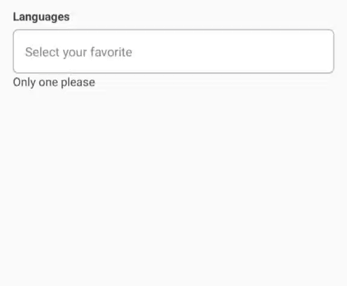
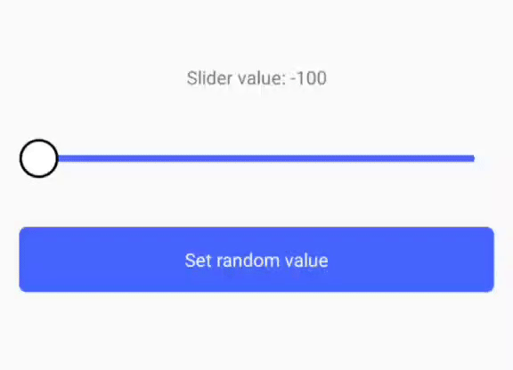
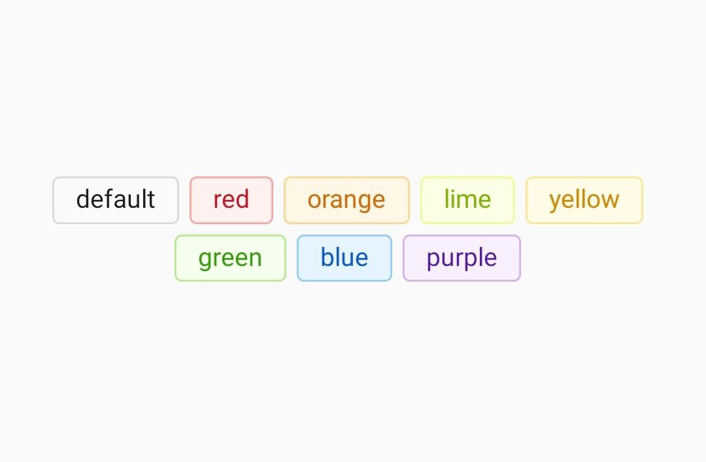
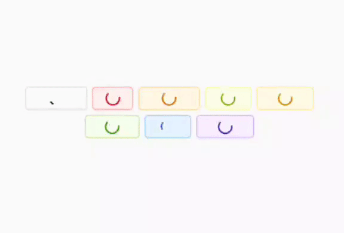
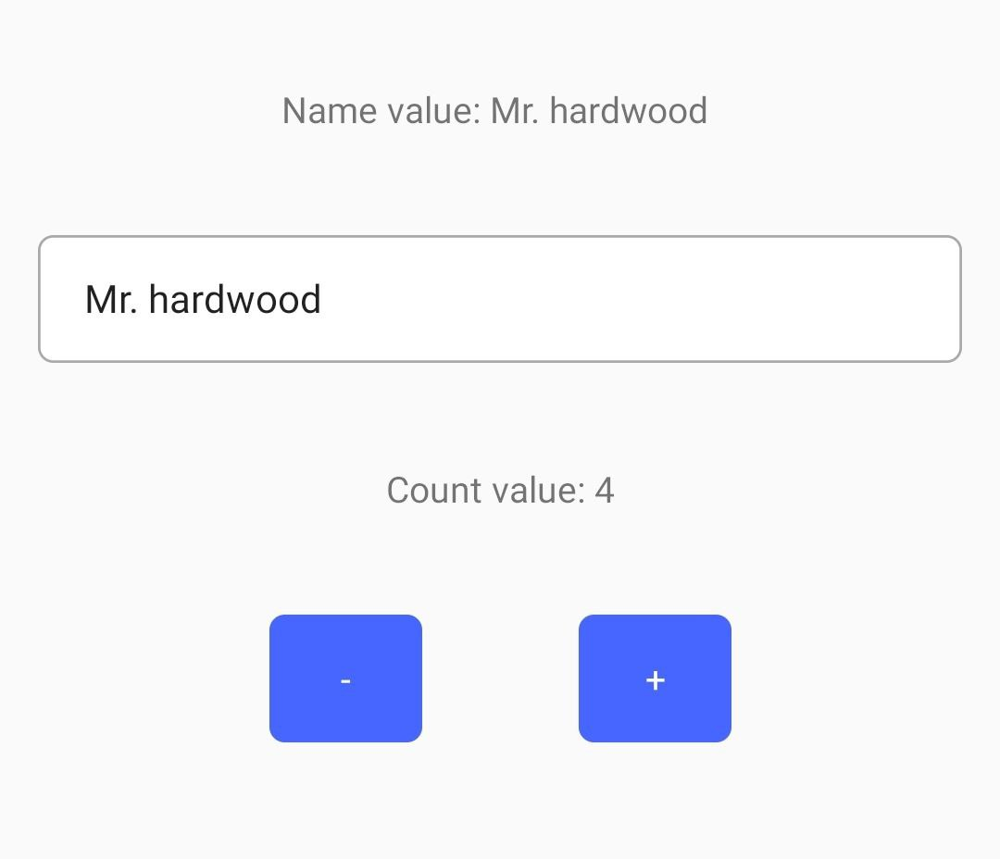

# tit-ui

tit-ui is a simple library that contains a set of UI components, functions and Form creating functionality. 

## Setup
To install lib open your project in command line and run:
```
npm install tit-ui
```
OR
```
yarn add tit-ui
```
Thats it!

### UI

- **_Switch_** - is UI component of switch:

```javascript
import { Switch, SwitchHandler } from 'tit-ui'

const [switchState, setSwitchState] = useState(false)
const switchRef = useRef<SwitchHandler>(null)

//...

return (
    <View style={styles.container}>
        <Switch ref={switchRef} />
        <Switch
            textStyle={{
                fontSize: 20
            }}
            containderStyle={{
                width: "50%",
                height: 50,
                marginTop: 15
            }}
            circleStyle={{
                width: "50%",
                height: 40,
                borderRadius: 20
            }}
            enabledCircleColor="#4DC861"
            disabledCircleColor="red"
            enabledText="On"
            disabledText="Off"
            enabledBackgroundColor="#ccc"
            disabledBackgroundColor="#ccc"
            onChangeState={switchState => setSwitchState(switchState)}
            initValue={true}
        />
    </View>
)

//...

```


#### Props
Name | Description | Default | Type
------|-------------|----------|-----------
ref | reference to component | undefined | SwitchHandler
value | value of switch | undefined | bool
initValue | initial position | false | bool
textStyle | switch text style | undefined | style
containerStyle | switch container style | undefined | style
circleStyle | switch circle style | undefined | style
enabledCircleColor | color for circle of switch when it is on | '#fff' | string
disabledCircleColor | color for circle of switch when it is off | '#fff' | string
enabledText | text of switch when it is on | undefined | string
disabledText | text of switch when it is off | undefined | string
enabledBackgroundColor | switch background color when it is on | '#4666ff' | string
disabledBackgroundColor | switch background color when it is off | '#ccc' | string
onChangeState | callback when switch is clicked| (value) => {callback(value)} | func

#### Methods
Name | Description | Return type
------|-------------|----------
value | value of switch | bool
setValue() | setting value | none

- **_Input_** - is UI component of text input. 

```javascript
//...
import { Input, InputHandler } from 'tit-ui'
//...
const [text, setText] = useState("")
const inputRef = useRef<InputHandler>(null)

return (
    <View style={styles.container}>
        <Input
            ref={inputRef}
            placeholder='Some placeholder'
            label='This is label'
            note='This is note'
        />
    </View>
)
//...
```


#### Props
Name | Description | Default | Type
------|-------------|----------|-----------
ref | reference to component | undefined | InputHandler
value | value of TextInput component | "" | string
containerStyle | style of container that includes input container, label and note | {} | object
inputContainerStyle | style of input container that includes TextInput, Left and Right components | {} | object
inputStyle | style of TextInput component | {} | object
labelStyle | style of label component on top of input that based on React-Native Text component | {} | object
noteStyle | style of note component on bottom of input that based on React-Native Text component | {} | object
label | text of label on top of input | "" | string
note | text of note on bottom of input | "" | string
focusedBorderColor | input container border color when TextInput is focused | "#4666ff" | string
focusedLabelColor | label text color when TextInput is focused | "#4666ff" | string
Left | component that will render on left side of input | null | React Component
Right | component that will render on right side of input | null | React Component
required | boolean prop that let Form component to know that this input is required, also add "requiredText" to label | false | boolean
requiredText | label additation when input is required | * | string
requiredTextStyle | style of "requiredText". Based on React-Native Text component | {} | object 
and all TextInput component props |  |  | any

#### Methods
Name | Description | Return type
------|-------------|----------
inputRef | reference of TextInput | React-Native reference
focused | true if TextInput focused and false if not | bool
value | value of TextInput | string
setValue() | setting value | none

- **_Button_** - is UI component of button.

```javascript
//...
import { Button } from 'tit-ui'
//...
return (
    <View style={styles.container}>
        <Button 
            text="Button"
        />
    </View>
)
```


#### Props
Name | Description | Default | Type
------|-------------|----------|-----------
style | style of Button component | object | style
textStyle | style of button text | object | style
onPress | function that call when button pressed | onPress={()=>{}} | func
text | text that will display on button | "Button" | string
loading | boolean props that show or hide spinner, also if loading true function "onPress" will not be called | false | bool
loadingColor | color of loading spinner | "#ffffff" | string

- **_RadioButton_** - is UI component of radio button.

```javascript
import { Radio, RadioButtonHandler } from 'tit-ui'
//...
const [value, setValue] = useState(false)
const [value1, setValue1] = useState(false)
const radioRef = useRef<RadioButtonHandler>(null)
//...
return (
    <View style={styles.container}>
        <Radio
            value={value}
            title="Title"
            onPress={() => setValue(!value)}
            activeColor="red"
            inactiveColor="black"
            containerStyle={{ marginBottom: 12 }}
        />
        <Radio
            value={value1}
            title="Title 1"
            onPress={() => setValue1(!value1)}
            activeColor="red"
            inactiveColor="black"
        />
    </View>
)
```


#### Props
Name | Description | Default | Type
------|-------------|----------|-----------
ref | reference to component | undefined | RadioButtonHandler
containerStyle | style of the component container | object | style
innerCircleStyle | style of the inner circle | object | style
circleStyle | style of the outer circle | object | style
value | value of button, if true button is checked | false | bool
onPress | function that call when button pressed | onPress={()=>{}} | func
title | text that will display on right side of button | "" | string
titleStyle | style of title component based on React-Native Text component | {} | object
activeColor | color of circles when button is checked | "#494043" | string
inactiveColor | color of circles when button is unchecked | "#494043" | string
initValue | initial value of button | false | bool

#### Methods
Name | Description | Return type
------|-------------|----------
value | value of radio button | bool
setValue() | setting value | none

- **_Avatar_** - is UI component of image for lists to profile screens.

```javascript
import { Avatar } from 'tit-ui'
//...
const styles = StyleSheet.create({
    container: {
        flex: 1,
        width,
        alignItems: "center",
        justifyContent: "center"
    }
})
//...

return (
    <View style={styles.container}>
        <Avatar
            source={{ uri:"https://encrypted-tbn0.gstatic.com/images?q=tbn%3AANd9GcSsb3dnwW7TWK8zRGaCQ_ThqeLRWTZKXsWAL5z6rI_9UAwM0NqH" }}
            nameString="Tit Hardwood"
            badge={100}
            style={{ marginBottom: 15 }}
        />
        <Avatar
            nameString="Tit Hardwood"
            badge={5}
        />
    </View>
)
```


#### Props
Name | Description | Default | Type
------|-------------|----------|-----------
source | source to image | undefined | React-Native Image component source
nameString | string of user name or description | "" | string
onPress | function that call when avatar pressed | onPress={()=>{}} | func
badge | used if you need to render badge on avatar | 0 | number
style | style of the component container | {} | style
imageStyle | style of the image | {} | style
badgeStyle | style of the badge | {} | style
badgeTextStyle | style of the badge | {} | style
imageProps | React-Native Image component props | undefined | object
letterStyle | style of letters of nameString when imageUrl is empty | {} | style

- **_Badge_** - is UI component used to render a numerical value.

```javascript
    import { Badge } from 'tit-ui'
    //...
    const styles = StyleSheet.create({
        container: {
            flex: 1,
            width,
            alignItems: "center",
            justifyContent: "center"
        }
    })
    //...
    return (
        <View style={styles.container}>
            <Badge badge={1} />
            <Badge badge={12} />
            <Badge badge={123} />
        </View>
    )
```


#### Props
Name | Description | Default | Type
------|-------------|----------|-----------
badge | used if you need to render badge on avatar | 0 | number
style | style of the component container | undefined | style
textStyle | style of the badge value | undefined | style

- **_Image_** - Image component with scale.

```javascript
import { Image } from 'tit-ui'

return (
    <Image
        source={{ uri: 'https://encrypted-tbn0.gstatic.com/images?q=tbn:ANd9GcRgrZ4O36TDysDmv3itq4KPoOVtE39kVgcC-NE0-iRp&s' }}
        style={{
            width: '100%',
            aspectRatio: 16 / 9
        }}
        canScale
    />
)
```


#### Props
Name | Description | Default | Type
------|-------------|----------|-----------
source | source to image | undefined | React-Native Image component source
canScale | props to enable or disable scale | false | bool
showLoading | show spinner while image loading | true | bool
containerStyle | style of component container | {} | object
imageStyle | style of React-Native Image component | {} | object
loadingContainerStyle | style of loading container | {} | object
loadingColor | color of loading spinner | {} | string
loadingSize | size of loading spinner | "large" | enum "large" or "small"
and all React-Native Image component props |  |  | any

- **_FlatList_** - is modified React-Native FlatList component.

```javascript
import { FlatList, Image } from 'tit-ui'

return(
    <FlatList
        data={new Array(10).fill({})}
        style={{ flex: 1 }}
        contentContainerStyle={{ padding: 12, alignItems: 'center' }}
        loading={true}
        renderItem={() => (
            <Image
                source={{ uri: 'https://encrypted-tbn0.gstatic.com/images?q=tbn:ANd9GcRgrZ4O36TDysDmv3itq4KPoOVtE39kVgcC-NE0-iRp&s' }}
                style={{
                    width: width - 30,
                    aspectRatio: 16 / 9,
                    marginBottom: 12
                }}
                canScale
            />
        )}
    />
)
```


#### Props
Name | Description | Default | Type
------|-------------|----------|-----------
loading | if this property is true refresh controll or LoadingConponent is showing up | false | bool
onRefresh | RefreshControl onRefresh property | () => {} | function
LoadinComponent | component that will be showing up instead of ListEmptyComponent if loading true | null | React-Native component
useRefreshControl | if true used RefreshControll component to FlatList | true | bool
emptyComponenText | Default ListEmptyComponent text | "There is nothing here" | string
and all FlatList component props |  |  | any

- **_Picker_** - Picker component like drop down menu.

```javascript
import { Picker } from 'tit-ui'

const pickerRef = useRef<PickerHandler>(null)

return (
    <Picker
        data={["JavaScript", "Pyton", "C++", "C#", "Ruby", "Swift", "Go"]}
        label='Language'
        containerStyle={{ marginBottom: 12 }}
    />
)
```


#### Props
Name | Description | Default | Type
------|-------------|----------|-----------
ref | reference to component | undefined | PickerHandler
containerStyle | style of component container | {} | object
pickerStyle | style of picker container | {} | object
labelStyle | style of label component on top of picker that based on React-Native Text component | {} | object
noteStyle | style of note component on bottom of picker that based on React-Native Text component | {} | object
textStyle | style of picker value text, based on React-Native Text component | {} | object
placeholderTextColor | placeholder text color, like React-Native TextInput component placeholderTextColor prop | "gray" | string
value | value of picker - selected item of data array | undefined | string or object
onPick | callback when picker item is selected. (value) => { ... } | undefined | function
data | array of values. Can be array of string (["1", "2", "3"]) or array of object ([{value: 1, label: "One"}, {value: 2, label: "Two"}]). Object must have a "value" and "label" | [] | array of string or array of object
placeholder | text showing when value is empty | "Pick something" | string
label | text of label on top of picker | "" | string
note | text of label on top of picker | "" | string
initValue | initial value of picker. Can be string of object. Object must have a "value" and "label" | "" | string or object
onOpen | callback on picker opened | undefined | function
onClose | callback on picker opened | undefined | function
Left | component that will render on left side of picker | null | React Component
Right | component that will render on right side of picker | null | React Component
listProps | props of list of data. Based on React-Native VirtualizedList component | {} | object
required | boolean prop that let Form component to know that this picker is required, also add "requiredText" to label | false | boolean
requiredText | label additation when picker is required | * | string
requiredTextStyle | style of "requiredText". Based on React-Native Text component | {} | object 

#### listProps
Name | Description | Default | Type
------|-------------|----------|-----------
itemStyle | style of list item. Based on React-Native Text component | {} | object
selectedItemStyle | style of selected list item. Based on React-Native Text component | {} | object
renderItem | callback that must return some component to render. ({ item, index, selected, pickItem }) => {...} | undefined | function
emptyText | text when data array is empty | 'There is nothing here' | string

#### Methods
Name | Description | Return type
------|-------------|----------
value | value of radio button | bool
setValue() | setting value | none
clear() | function to clear picker value | undefined | function
open() | function to open picker | undefined | function
close() | function to close picker | undefined | function

- **_Slider_** - Slider component to select single value from a range of values.

```javascript
    import { Slider, Button } from 'tit-ui'
    //...
    const sliderRef = useRef<SliderHandler>(null);
    const [sliderValue, setSliderValue] = useState(-100);

    return (
        <>
            <Text>Slider value: {sliderValue}</Text>
            <Slider
                ref={sliderRef}
                onValueChange={value => {
                    setSliderValue(value);
                }}
                minValue={-100}
                maxValue={100}
                initValue={0}
                style={{marginVertical: 50}}
            />
            <Button
                text="Set random value"
                onPress={() => {
                    const randomValue = Math.floor(Math.random() * (100 - -100) + -100);
                    refs.get('slider').setValue(randomValue);
                }}
            />
        </>
    )
```


#### Props
Name | Description | Default | Type
------|-------------|----------|-----------
ref | reference to component | undefined | SliderHandler
minValue | initial minimum value of the slider | 0 | number
maxValue | maximum value of slider | 100 | number
initValue | initial value of slider | minValue | 0 | number
style | style of the component container | undefined | style
trackStyle | style of slider track line | undefined | style
circleStyle | style of circle on track | undefined | style
circleSize | size of circle | 30 | number
circleIsScale | boolean props to enable or disable circle scale on press | true | boolean
circleMaxScale | circle scale value | 1.3 | float
CustomCircle | component that will render instead of default circle | null | React Component
onValueChange | callback when slider value changed | (value) => {callback(value)} | func

#### Methods
Name | Description | Return type
------|-------------|----------
value | value of slider | number
setValue() | setting value | none

- **_Tag_** - Tag for markup.

```javascript
    import { Tag } from 'tit-ui'
    //...
    return (
        <View
            style={{
                flexWrap: 'wrap',
                flexDirection: 'row',
                justifyContent: 'center',
            }}
        >
            <Tag text="default" />
            <Tag text="red" color="red" />
            <Tag text="orange" color="orange" />
            <Tag text="lime" color="lime" />
            <Tag text="yellow" color="yellow" />
            <Tag text="green" color="green" />
            <Tag text="blue" color="blue" />
            <Tag text="purple" color="purple" />
        </View>
    )
```



#### Props
Name | Description | Default | Type
------|-------------|----------|-----------
text | text of tag | "tag" | string
onPress | function that call when tag pressed | onPress={()=>{}} | func
style | style of the component container | undefined | style
textStyle | style of tag text | undefined | style
color | color of tag | undefined | on of ['red','orange','yellow','lime','green','blue','purple']
Left | component that will render on left side of tag text | null | React Component
Right | component that will render on right side of tag text | null | React Component
loading | boolean props that show or hide spinner | false | bool
loadingProps | ActivityIndicator Props | undefined | ActivityIndicatorProps

### Form
Form is wrapper component that can return all named components value like web forms. Working with UI components of this library. If you can use web forms you know how to use this Form. All you need is:

1. **Name your components** - Provide a "name" props to component you want to take a value. This name will be key in returned result data object.

2. **Mark your required components** - Provide a "required" props to component you want to make it required. If required component doesn't filled submit function will return error object in result.

3. **Mark your trigger** - Provide a "type" props with string "submit" value to mark trigger. All pressable component can be a trigger. Form put "onSubmit" function into "onPress" props of it. And when trigger pressed values will pass to "onSubmit" function arguments.

4. **Provide a "onSubmit" function** - Provide a function in "onSubmit" props of Form compoent.

Thats it! Your form is ready. If you want to use your own component in Form, you should modify your component like [this](../main/examples/how%20to%20use%20your%20own%20components%20in%20Form.md).

```javascript
import { Form, Input, Picker, Radio, Switch, Button, FormHandler } from 'tit-ui'

const formRef = useRef<FormHandler>(null);

return (
    <Form
        ref={formRef}
        onSubmit={(result) => { //onSubmit function
            const { data, errors } = result // result contains "data" and "errors"
            if (data) { //data will be "null" if form get errors
                console.log("data", data)
            }
            if (errors) {
                console.log("errors", errors)
            }
        }}
        initValues={{
            name: "Tit",
            surname: "Hardwood",
            switch: true
        }}
    >
        <View style={{ flexDirection: "row", width: "100%", justifyContent: "space-between" }}>
            <Input
                placeholder='name'
                containerStyle={{ marginBottom: 12, width: '48%' }}
                label='Name'
                name='name' //this name prop 
            />
            <Input
                placeholder='surname'
                containerStyle={{ marginBottom: 12, width: '48%' }}
                label='Surname'
                name='surname' //this name prop 
            />
        </View>
        <Input
            placeholder='pass'
            label='Pass'
            containerStyle={{ marginBottom: 12 }}
            name='pass' //this name prop 
        />
        <Picker
            data={["JavaScript", "Pyton", "C++", "C#", "Ruby", "Swift", "Go"]}
            label='Language'
            containerStyle={{ marginBottom: 12 }}
            placeholder='Select your favorite'
            required // this is required prop
        />
        <Radio
            name='check-box' //this name prop 
            title='need your submition'
            containerStyle={{ marginBottom: 12 }}
        />
        <View style={{ flexDirection: 'row', width: "100%" }}>
            <Switch
                name='switch' //this name prop 
                containerStyle={{ marginBottom: 12 }}
            />
            <Text style={{ marginLeft: 6 }}>wont to subscribe to notificattion</Text>
        </View>
        <Button
            type='submit' //this is trigger props 
            text="Submit"
        />
    </Form>
)
```

#### Props
Name | Description | Default | Type
------|-------------|----------|-----------
ref | reference to component | undefined | SliderHandler
onSubmit | Function that return values and errors by object ({data, errors}) => {...} | undefined | function
initValues | object of initial values of form | undefined | object

#### Methods
Name | Description | Return type
------|-------------|----------
submit() | Method to trigger "onSubmit" function | none

### Provider
This is the store provider with simple logic - describe initial state and change it with one function. To it use:

1. **Wrap with Provider** - Wrap root component with Provider and describe initial states.
```javascript
import { Provider } from 'tit-ui'

type GlodalState = {
  count: number;
  name: string;
};

//...

const initValue = {
    count: 0, 
    name: ''
} as GlodalState

return (
    <Provider<GlodalState> initValue={initValue}>
        <App />
    </Provider>
);
```

2. **Render states and change it** - use useStateValue hook to get states and change it.
```javascript
import { useStateValue } from 'tit-ui'

type GlodalState = {
  count: number;
  name: string;
};

//...

const [state, setState] = useStateValue<GlodalState>();

return (
    <View style={{flex: 1, alignItems: 'center'}}>
        <Text style={{marginVertical: 40}}>Name value: {state.name}</Text>
        <Input
            value={state.name}
            onChangeText={text => setState({name: text})}
            placeholder="Enter name"
        />
        <Text style={{marginVertical: 40}}>Count value: {state.count}</Text>
        <View
            style={{
                width: '50%',
                justifyContent: 'space-between',
                flexDirection: 'row',
            }}>
            <Button
                text="-"
                onPress={() => {
                    setState({count: state.count - 1});
                }}
                style={{width: 60}}
            />
            <Button
                text="+"
                onPress={() => {
                    setState({count: state.count + 1});
                }}
                style={{width: 60}}
            />
        </View>
    </View>
)
```


#### Props
Name | Description | Default | Type
------|-------------|----------|-----------
initValue | initial states | {} | object
#### Hooks
Name | Description | Return type
------|-------------|----------
useStateValue | return states and function to change it | [state: object, setState(data: object) => void]

### Toast 
This is the toast component to display global messages.

1. **Render Toast component** - Put Toast component on the root file.

```javascript
import { Provider } from 'tit-ui'

type GlodalState = {
  count: number;
  name: string;
};

//...

const initValue = {
    count: 0, 
    name: ''
} as GlodalState

return (
    <Provider<GlodalState> initValue={initValue}>
        <App />
        <Toast
            maxToShow={4}
            duration={2000}
        />
    </Provider>
);
```

1. **Display the message** - Call showToast function to disaplay the message.

```javascript
import { Button, showToast } from 'tit-ui'

//...

return (
    <Button
        text="message"
        onPress={() => {
            showToast({
                title: 'Success',
                text: 'Everything fine',
                duration: 2000,
            });
        }}
    />
)

```

You can use default themes to display different types of message:

```javascript
import { Button, showToast } from 'tit-ui'

//...

return (
    <Button
        text="message"
        onPress={() => {
            showToast({
                text: 'Everything fine',
                duration: 20000,
                theme: DefaultThems.Success,
                title: 'Success',
            });
            setTimeout(() => {
                showToast({
                    text: 'Something went wrong',
                    duration: 20000,
                    theme: DefaultThems.Error,
                    title: 'Error',
                });
            }, 100);
            setTimeout(() => {
                showToast({
                    text: 'This is the toast message',
                    duration: 20000,
                    theme: DefaultThems.Info,
                    title: 'Info',
                });
            }, 200);
            setTimeout(() => {
                showToast({
                    text: "URL can't be an empty string",
                    duration: 20000,
                    theme: DefaultThems.Warning,
                    title: 'Warning',
                });
            }, 300);
        }}
    />
)
```


You can provide custom themes. Provide thems to the Toast component props: 

```javascript
import { Provider } from 'tit-ui'

type GlodalState = {
  count: number;
  name: string;
};

//...

const initValue = {
    count: 0, 
    name: ''
} as GlodalState

return (
    <Provider<GlodalState> initValue={initValue}>
        <App />
        <Toast
            maxToShow={4}
            duration={2000}
            themes={{
                mySuccess: {
                    style: {
                        backgroundColor: '#1fb141',
                        elevation: 0,
                        borderWidth: 0,
                    },
                    textStyle: {
                        color: 'white',
                    },
                    titleStyle: {
                        color: 'white',
                    },
                },
                myError: {
                    style: {
                        backgroundColor: 'red',
                        elevation: 0,
                        borderWidth: 0,
                    },
                    titleStyle: {
                        color: 'white',
                    },
                    textStyle: {
                        color: 'white',
                    },
                },
            }}
        />
    </Provider>
);
```

```javascript
import { Button, showToast } from 'tit-ui'

//...

return (
    <Button
        text="message"
        onPress={() => {
            showToast({
                text: 'Everything fine',
                duration: 20000,
                theme: 'mySuccess',
                title: 'Success',
            });
            setTimeout(() => {
                showToast({
                    text: 'Something went wrong',
                    duration: 20000,
                    theme: 'myError',
                    title: 'Error',
                });
            }, 100);
        }}
    />
)
```


Use your custom toast message, like this: 

```javascript
import { Provider } from 'tit-ui'

type GlodalState = {
  count: number;
  name: string;
};

//...

const initValue = {
    count: 0, 
    name: ''
} as GlodalState

return (
    <Provider<GlodalState> initValue={initValue}>
        <App />
        <Toast
            maxToShow={4}
            duration={2000}
            renderToast={({style, textStyle, text, title, removeToast, id}) => (
            <View style={style}>
                <Text style={[textStyle, {fontSize: 21}]}>{title}</Text>
                <Text style={textStyle}>{text}</Text>
                <View
                style={{
                    width: '100%',
                    flexDirection: 'row',
                    justifyContent: 'space-between',
                    marginTop: 12,
                }}>
                <Button
                    text="Ok"
                    onPress={() => removeToast(id)}
                    style={{width: '48%'}}
                />
                <Button
                    text="Cancel"
                    onPress={() => removeToast(id)}
                    style={{width: '48%'}}
                />
                </View>
            </View>
            )}
        />
    </Provider>
);
```

Or like this:

```javascript
import { Button, showToast } from 'tit-ui'

//...

return (
    <Button
        text="message"
        onPress={() => {
          showToast({
            text: 'Do you want it?',
            duration: 'infinite',
            title: 'Confirm',
            closeOnTap: false,
            renderToast: ({style, textStyle, text, title, removeToast, id}) => (
              <View style={style}>
                <Text style={[textStyle, {fontSize: 21}]}>{title}</Text>
                <Text style={textStyle}>{text}</Text>
                <View
                  style={{
                    width: '100%',
                    flexDirection: 'row',
                    justifyContent: 'space-between',
                    marginTop: 12,
                  }}>
                  <Button
                    text="Ok"
                    onPress={() => removeToast(id)}
                    style={{width: '48%'}}
                  />
                  <Button
                    text="Cancel"
                    onPress={() => removeToast(id)}
                    style={{width: '48%'}}
                  />
                </View>
              </View>
            ),
          });
        }}
    />
)
```


#### Toast Props
Name | Description | Default | Type
------|-------------|----------|-----------
maxToShow | property to conrol messages count that will display on sceen | 3 | number;
duration | message displaying duration in milliseconds | 3000 | number or 'infinite';
themes | themes of messages | DefaultThems type | Theme type;
renderToast | function to render custom toast | undefined | (props: RenderToastProps) => ReactNode;
#### showToast
Name | Description | Default | Type
------|-------------|----------|-----------
text | text of the message | undefined | string
title | title of the message | undefined | string
theme | key of theme | undefined | string 
duration | message displaying duration in milliseconds | 3000 | number or 'infinite';
closeOnTap | if this property is true message will close on tap | true | boolean
renderToast | function to render custom toast | undefined | (props: RenderToastProps) => ReactNode;

### Functions
- **_normalize_** - is a function which normalizes the font size of the text relative to the screen size.

```javascript
import { normalize } from 'tit-ui'

//...

return (
    <View style={styles.container}>
        <Text style={{ fontSize: normalize(14), color: "#000000", marginBottom: 15 }}>Some text</Text>
    </View>
);

const styles = StyleSheet.create({
    container: {
        flex: 1,
        justifyContent: 'center',
        alignItems: 'center',
        backgroundColor: '#F5FCFF',
    },
});
```

- **_hexToRgba_** - is a function that can convert color hex value to rgb or rgba. To use it:


```javascript
import { hexToRgba } from 'tit-ui'
//...
const color = "#c260b5"
const alpha = 0.2
return (
    <View style={styles.container}>
        <Text>{color}</Text>
        <Text>{hexToRgba(color)}</Text>
        <Text>{hexToRgba(color, alpha)}</Text>
    </View>
)
```


- **_measure_** - is a async function that can return width ,height, x and y positons in window by component ref.

```javascript
import { measure } from 'tit-ui'
//...

const viewRef = useRef()

const getMeasure = async () => {
    const { x, y, width, height } = await measure(viewRef.current) // return width, height and position in window(x,y)
}

return (
    <View ref={viewRef}>
        ...
    </View>
)
```
