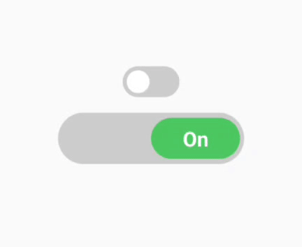
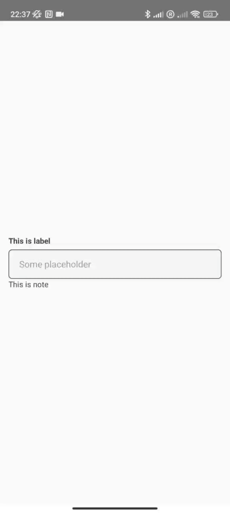
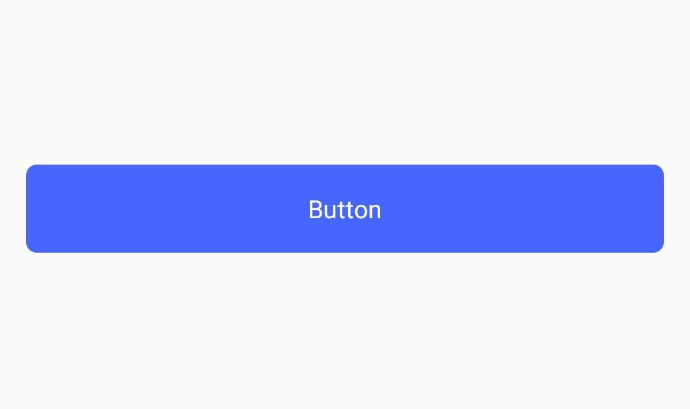
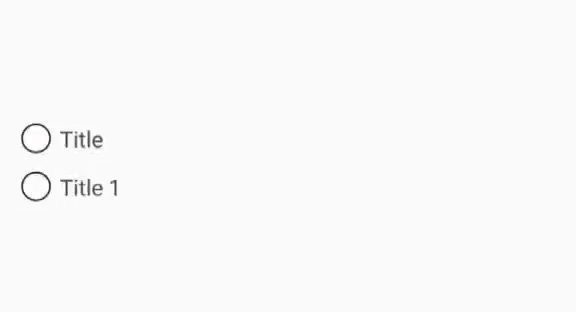
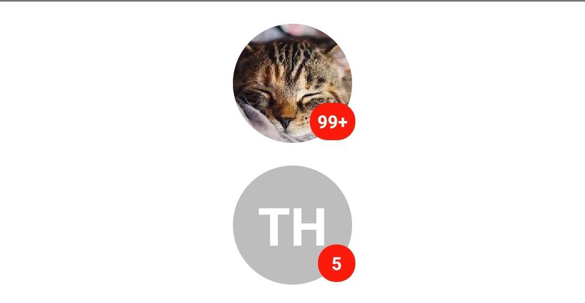
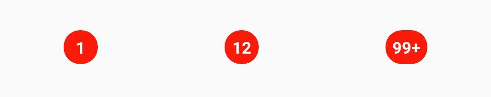
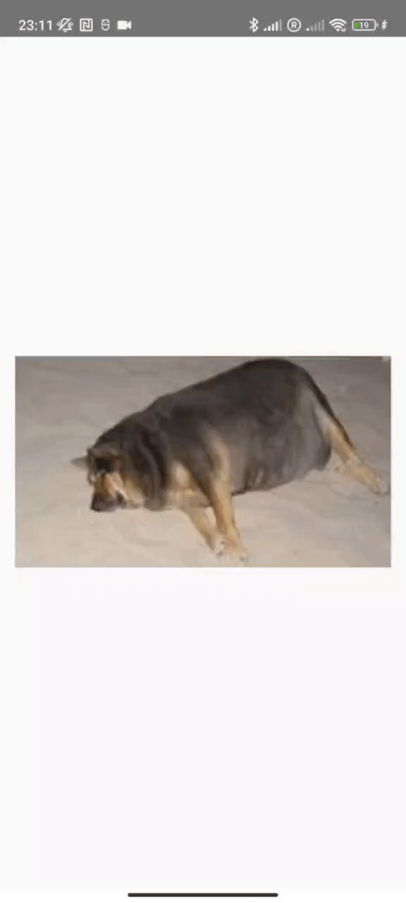
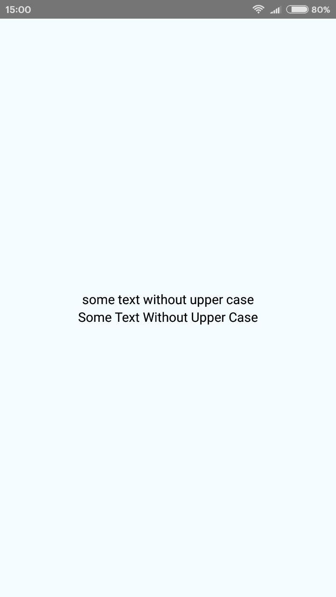
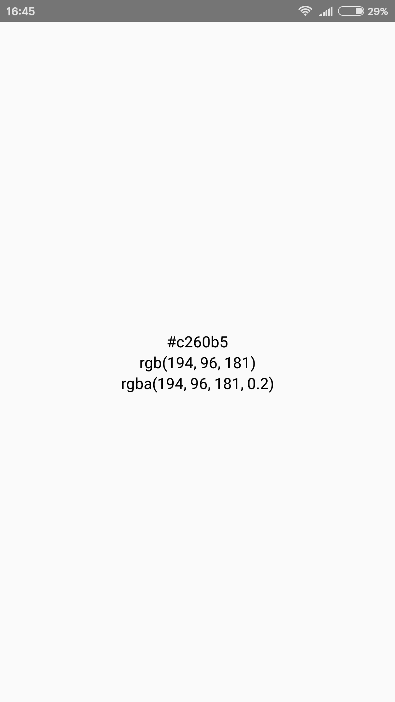

# tit-ui

tit-ui is a simple library that contains a set of UI components, functions and Form creating functionality. 

## Setup
To install lib open your project in command line and run:
```
npm install tit-ui
```
OR
```
yarn add tit-ui
```
Thats it!

## Usage

For use you can import Functions, UI and Form:

```javascript
import { Functions, UI, Form } from 'tit-ui'
```

### UI

- **_Switch_** - is UI component of switch:

```javascript
import { UI } from 'tit-ui'

const [switchState, setSwitchState] = useState(false)

//...

return (
    <View style={styles.container}>
        <UI.Switch />
        <UI.Switch
            textStyle={{
                fontSize: 20
            }}
            containderStyle={{
                width: "50%",
                height: 50,
                marginTop: 15
            }}
            circleStyle={{
                width: "50%",
                height: 40,
                borderRadius: 20
            }}
            enabledCircleColor="#4DC861"
            disabledCircleColor="red"
            enabledText="On"
            disabledText="Off"
            enabledBackgroundColor="#ccc"
            disabledBackgroundColor="#ccc"
            onChangeState={switchState => setSwitchState(switchState)}
            initValue={true}
        />
    </View>
)

//...

```



#### Props
Name | Description | Default | Type
------|-------------|----------|-----------
value | value of switch | undefined | bool
initValue | initial position | false | bool
textStyle | switch text style | undefined | style
containerStyle | switch container style | undefined | style
circleStyle | switch circle style | undefined | style
enabledCircleColor | color for circle of switch when it is on | '#fff' | string
disabledCircleColor | color for circle of switch when it is off | '#fff' | string
enabledText | text of switch when it is on | undefined | string
disabledText | text of switch when it is off | undefined | string
enabledBackgroundColor | switch background color when it is on | '#4666ff' | string
disabledBackgroundColor | switch background color when it is off | '#ccc' | string
onChangeState | callback when switch is clicked| (value) => {callback(value)} | func

#### Methods
Name | Description | Return type
------|-------------|----------|-----------
value | value of switch | bool
setValue() | seting value | none

- **_TextInput_** - is UI component of text input. 

```javascript
//...
import { UI } from 'tit-ui'
//...
const [text, setText] = useState("")

return (
    <View style={styles.container}>
        <UI.Input
            placeholder='Some placeholder'
            label='This is label'
            note='This is note'
        />
    </View>
)
//...
```



#### Props
Name | Description | Default | Type
------|-------------|----------|-----------
value | value of TextInput component | "" | string
containerStyle | style of container that includes input container, label and note | {} | object
inputContainerStyle | style of input container that includes TextInput, Left and Right components | {} | object
inputStyle | style of TextInput component | {} | object
labelStyle | style of label component on top of input that based on React-Native Text component | {} | object
noteStyle | style of note component on bottom of input that based on React-Native Text component | {} | object
label | text of label on top of input | "" | string
note | text of note on bottom of input | "" | string
focusedBorderColor | input container border color when TextInput is focused | "#4666ff" | string
focusedLabelColor | label text color when TextInput is focused | "#4666ff" | string
Left | component that will render on left side of input | null | React Component
Right | component that will render on right side of input | null | React Component
and all TextInput component props |  |  | any

#### Methods
Name | Description | Return type
------|-------------|----------|-----------
inputRef | reference of TextInput | React-Native reference
focused | true if TextInput focused and false if not | bool
value | value of TextInput | string
setValue() | seting value | none

- **_Button_** - is UI component of button.

```javascript
//...
import { UI } from 'tit-ui'
//...
return (
    <View style={styles.container}>
        <UI.Button 
            text="Button"
        />
    </View>
)
```



#### Props
Name | Description | Default | Type
------|-------------|----------|-----------
style | style of Button component | object | style
textStyle | style of button text | object | style
onPress | function that call when button pressed | onPress={()=>{}} | func
text | text that will display on button | "Button" | string
loading | boolean props that show or hide spinner, also if loading true function "onPress" will not be called | false | bool
loadingColor | color of loading spinner | "#ffffff" | string

- **_RadioButton_** - is UI component of radio button.

```javascript
import { UI } from 'tit-ui'
//...
const [value, setValue] = useState(false)
const [value1, setValue1] = useState(false)
//...
return (
    <View style={styles.container}>
        <UI.Radio
            value={value}
            title="Title"
            onPress={() => setValue(!value)}
            activeColor="red"
            inactiveColor="black"
            containerStyle={{ marginBottom: 12 }}
        />
        <UI.Radio
            value={value1}
            title="Title 1"
            onPress={() => setValue1(!value1)}
            activeColor="red"
            inactiveColor="black"
        />
    </View>
)
```



#### Props
Name | Description | Default | Type
------|-------------|----------|-----------
containerStyle | style of the component container | object | style
innerCircleStyle | style of the inner circle | object | style
circleStyle | style of the outer circle | object | style
value | value of button, if true button is checked | false | bool
onPress | function that call when button pressed | onPress={()=>{}} | func
title | text that will display on right side of button | "" | string
titleStyle | style of title component based on React-Native Text component | {} | object
activeColor | color of circles when button is checked | "#494043" | string
inactiveColor | color of circles when button is unchecked | "#494043" | string
initValue | initial value of button | false | bool

#### Methods
Name | Description | Return type
------|-------------|----------|-----------
value | value of radio button | bool
setValue() | seting value | none

- **_Avatar_** - is UI component of image for lists to profile screens.

```javascript
import { UI } from 'tit-ui'
//...
const styles = StyleSheet.create({
    container: {
        flex: 1,
        width,
        alignItems: "center",
        justifyContent: "center"
    }
})
//...

return (
    <View style={styles.container}>
        <UI.Avatar
            source={{ uri:"https://encrypted-tbn0.gstatic.com/images?q=tbn%3AANd9GcSsb3dnwW7TWK8zRGaCQ_ThqeLRWTZKXsWAL5z6rI_9UAwM0NqH" }}
            nameString="Tit Hardwood"
            badge={100}
            style={{ marginBottom: 15 }}
        />
        <UI.Avatar
            nameString="Tit Hardwood"
            badge={5}
        />
    </View>
)
```



#### Props
Name | Description | Default | Type
------|-------------|----------|-----------
source | source to image | undefined | React-Native Image component source
nameString | string of user name or description | "" | string
onPress | function that call when avatar pressed | onPress={()=>{}} | func
badge | used if you need to render badge on avatar | 0 | number
style | style of the component container | {} | style
imageStyle | style of the image | {} | style
badgeStyle | style of the badge | {} | style
badgeTextStyle | style of the badge | {} | style
imageProps | React-Native Image component props | undefined | object
letterStyle | style of letters of nameString when imageUrl is empty | {} | style

- **_Badge_** - is UI component used to render a numerical value.

```javascript
    import { UI } from 'tit-ui'
    //...
    const styles = StyleSheet.create({
        container: {
            flex: 1,
            width,
            alignItems: "center",
            justifyContent: "center"
        }
    })
    //...
    return (
        <View style={styles.container}>
            <UI.Badge badge={1} />
            <UI.Badge badge={12} />
            <UI.Badge badge={123} />
        </View>
    )
```



#### Props
Name | Description | Default | Type
------|-------------|----------|-----------
badge | used if you need to render badge on avatar | 0 | number
style | style of the component container | object | style
textStyle | style of the badge value | object | style

- **_Image_** - Image component with scale.

```javascript
import { UI } from 'tit-ui'

return (
    <UI.Image
        source={{ uri: 'https://encrypted-tbn0.gstatic.com/images?q=tbn:ANd9GcRgrZ4O36TDysDmv3itq4KPoOVtE39kVgcC-NE0-iRp&s' }}
        style={{
            width: '100%',
            aspectRatio: 16 / 9
        }}
        canScale
    />
)
```



#### Props
Name | Description | Default | Type
------|-------------|----------|-----------
source | source to image | undefined | React-Native Image component source
canScale | props to enable or disable scale | false | bool
showLoading | show spinner while image loading | true | bool
containerStyle | style of component container | {} | object
imageStyle | style of React-Native Image component | {} | object
loadingContainerStyle | style of loading container | {} | object
loadingColor | color of loading spinner | {} | string
loadingSize | size of loading spinner | "large" | enum "large" or "small"
and all React-Native Image component props |  |  | any

- **_FlatList_** - is modified React-Native FlatList component.

```javascript
import { UI } from 'tit-ui'

return(
    <UI.FlatList
        data={new Array(10).fill({})}
        style={{ flex: 1 }}
        contentContainerStyle={{ padding: 12, alignItems: 'center' }}
        loading={true}
        renderItem={() => (
            <UI.Image
                source={{ uri: 'https://encrypted-tbn0.gstatic.com/images?q=tbn:ANd9GcRgrZ4O36TDysDmv3itq4KPoOVtE39kVgcC-NE0-iRp&s' }}
                style={{
                    width: width - 30,
                    aspectRatio: 16 / 9,
                    marginBottom: 12
                }}
                canScale
            />
        )}
    />
)
```


#### Props
Name | Description | Default | Type
------|-------------|----------|-----------
loading | if this property is true refresh controll or LoadingConponent is showing up | false | bool
onRefresh | RefreshControl onRefresh property | () => {} | function
LoadinComponent | component that will be showing up instead of ListEmptyComponent if loading true | null | React-Native component
useRefreshControl | if true used RefreshControll component to FlatList | true | bool
emptyComponenText | Default ListEmptyComponent text | "There is nothing here" | string
and all FlatList component props |  |  | any

### Form
Form is wrapper component that can return all named components value like web forms. Working with UI components of this library. If you can use web forms you know how to use this Form. All you need is:

1. **Name your components** - Provide a "name" props to component you want to take a value. This name will be key in returned result object

2. **Mark your trigger** - Provide a "type" props with string "submit" value to mark trigger. All pressable component can be a trigger. Form put "onSubmit" function into "onPress" props of it. And when trigger pressed values will pass to "onSubmit" function arguments.

3. **Provide a "onSubmit" function** - Provide a function in "onSubmit" props of Form compoent.

Thats it! Your form is ready. If you want to use your own component in Form, you should modify your component like [this](../main/examples/how%20to%20use%20your%20own%20components%20in%20Form.md).

```javascript
import { Form, UI } from 'tit-ui'

return (
    <Form
        onSubmit={(result) => { //onSubmit function
            console.log("result", result)
            alert(JSON.stringify(result))
        }}
        initValues={{
            name: "Tit",
            surname: "Hardwood",
            switch: true
        }}
    >
        <View style={{ flexDirection: "row", width: "100%", justifyContent: "space-between" }}>
            <UI.Input
                placeholder='name'
                containerStyle={{ marginBottom: 12, width: '48%' }}
                label='Name'
                name='name' //this name prop 
            />
            <UI.Input
                placeholder='surname'
                containerStyle={{ marginBottom: 12, width: '48%' }}
                label='Surname'
                name='surname' //this name prop 
            />
        </View>
        <UI.Input
            placeholder='pass'
            label='Pass'
            containerStyle={{ marginBottom: 12 }}
            name='pass' //this name prop 
        />
        <UI.Radio
            name='check-box' //this name prop 
            title='need your submition'
            containerStyle={{ marginBottom: 12 }}
        />
        <View style={{ flexDirection: 'row', width: "100%" }}>
            <UI.Switch
                name='switch' //this name prop 
                containerStyle={{ marginBottom: 12 }}
            />
            <Text style={{ marginLeft: 6 }}>wont to subscribe to notificattion</Text>
        </View>
        <UI.Button
            type='submit' //this is trigger props 
            text="Submit"
        />
    </Form>
)
```

#### Props
Name | Description | Default | Type
------|-------------|----------|-----------
onSubmit | Function that return values by object | undefined | function
initValues | object of initial values of form | undefined | object

#### Methods
Name | Description | Return type
------|-------------|----------|-----------
submit() | Method to trigger "onSubmit" function | none

### Functions
- **_normalize_** - is a function which normalizes the font size of the text relative to the screen size.

```javascript
import { Functions } from 'tit-ui'

//...

return (
    <View style={styles.container}>
        <Text style={{ fontSize: Functions.normalize(14), color: "#000000", marginBottom: 15 }}>Some text</Text>
    </View>
);

const styles = StyleSheet.create({
    container: {
        flex: 1,
        justifyContent: 'center',
        alignItems: 'center',
        backgroundColor: '#F5FCFF',
    },
});
```

- **_wordsFromUpperCase_** - is a regex function that replace words first lower case character to upper.

```javascript
import { Functions } from 'tit-ui'

//...

return (
    <View style={styles.container}>
        <Text style={{ fontSize: 14, color: "#000000" }}>{"some text without upper case"}</Text>
        <Text style={{ fontSize: 14, color: "#000000" }}>{Functions.wordsFromUpperCase("some text without upper case")}</Text>
    </View>
);

const styles = StyleSheet.create({
    container: {
        flex: 1,
        justifyContent: 'center',
        alignItems: 'center',
        backgroundColor: '#F5FCFF',
    },
});
```



- **_hexToRgba_** - is a function that can convert color hex value to rgb or rgba.

```javascript
import { Functions } from 'tit-ui'
//...
const color = "#c260b5"
const alpha = 0.2
return (
    <View style={styles.container}>
        <Text>{color}</Text>
        <Text>{Functions.hexToRgba(color)}</Text>
        <Text>{Functions.hexToRgba(color, alpha)}</Text>
    </View>
)
```


